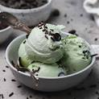

Mint chocolate chip ice cream is a flavor composed of mint ice cream with small chocolate chips. In some cases, the liqueur crème de menthe is used to provide the mint flavor, but in most cases, peppermint or spearmint flavoring is used 1. It’s a popular flavor and was ranked as America’s 4th most popular ice cream flavor in a July 2017 survey by the International Dairy Foods Association (IDFA)

# Ingredients

- Mint chocolate chips: You will need a 12 ounce bag of mint flavored chocolate chips.

- Butter: Use one tablespoon of butter to help give the melted chocolate a nicer texture and shine.

- Heavy cream: 3 tablespoons of heavy cream will give the chocolate a nice consistency.

- Peppermint extract: Use 1/2 teaspoon of peppermint extract to help flavor these chocolate mints.

- Green food coloring: This is optional but you can add in 2 drops of green food coloring to make these look more fun.

- Semi-sweet chocolate chips: Use 1/2 cup of semi sweet chocolate chips to give these mints a nice chocolate swirl.

