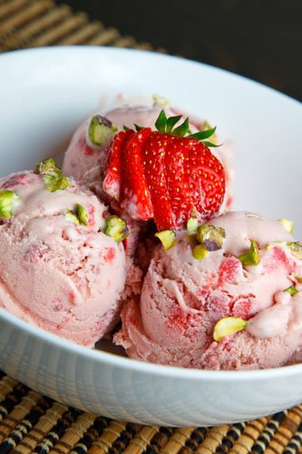

# Balsamic Strawberry Flavor

## Introduction

The Balsamic Strawberry flavor is a delightful combination of sweet and tangy, marrying the succulent taste of ripe strawberries with the richness of balsamic vinegar. This unique fusion creates an unforgettable taste experience that tantalizes your taste buds and leaves you craving for more.

## Origins

The inspiration behind the Balsamic Strawberry flavor comes from the culinary world, where the pairing of balsamic vinegar and strawberries has been appreciated for its harmonious blend of flavors. The concept of incorporating this delicious blend into a confectionery delight was a stroke of culinary genius.

## Taste Profile

The Balsamic Strawberry flavor offers a multi-dimensional taste profile that sets it apart from traditional strawberry treats. The initial burst of sweetness from the ripe strawberries is quickly followed by a subtle tanginess from the balsamic vinegar. The combination creates a balanced and sophisticated flavor that appeals to both strawberry lovers and those seeking unique and adventurous tastes.

## Culinary Uses

The Balsamic Strawberry flavor can be found in a variety of culinary creations. Some popular uses include:

- Balsamic Strawberry Ice Cream: Creamy and refreshing, this frozen dessert offers the perfect blend of fruity sweetness and tanginess.

- Balsamic Strawberry Tarts: Buttery, flaky tarts filled with luscious balsamic strawberry compote make for an exquisite dessert.

- Balsamic Strawberry Sauce: Ideal as a topping for pancakes, waffles, or even drizzled over a scoop of vanilla ice cream.

## Health Benefits

Strawberries are a rich source of antioxidants, vitamin C, and other essential nutrients. Balsamic vinegar, in moderation, has been associated with potential health benefits like improved digestion and blood sugar regulation.

## Conclusion

The Balsamic Strawberry flavor is a gourmet delight that showcases the beauty of pairing seemingly contrasting flavors. Whether enjoyed in ice cream, tarts, or sauces, this flavor is sure to leave a lasting impression on anyone fortunate enough to experience it.

Next time you're looking for a culinary adventure, don't hesitate to explore the captivating world of Balsamic Strawberry flavor!

## Prices

* 1 cup - 6 lei
* 2 cups - 11 lei
* 3 cups - 15 lei
* 4 cups - 25 lei